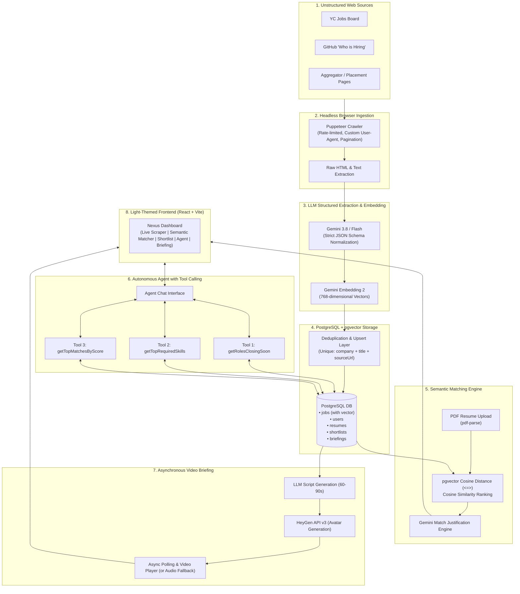

# NEXUS: Autonomous Career Intelligence Agent

> **"Scrape the messy web → structure it with an LLM → match it semantically → query it with an agent → deliver it as a generated video briefing."**

NEXUS is an end-to-end, full-stack AI career intelligence system built for the **AI and Software Guild — Software Development Recruitment 2026–27**. 

Job and internship opportunities live across messy, paginated, and unstructured web pages without clean APIs. NEXUS crawls these heterogeneous sources, extracts and validates structured job schemas via Google Gemini, indexes semantic vector embeddings with PostgreSQL & `pgvector`, matches candidates against uploaded resumes with cosine similarity and LLM justifications, offers an autonomous tool-calling chat agent, and renders weekly video briefings via HeyGen.

---
### 🚧 Unfinished & Roadmap Features
- [ ] **Automated Cron Daemon**: Background worker (e.g., node-cron or BullMQ) to re-scrape specified source URLs every 24 hours automatically.
- [ ] **Listing Change Detection**: Diffing saved listings on subsequent scrapes to flag when a job is edited or closed.
- [ ] **Live Token & Rupee Cost Dashboard**: Tracking token counts per Gemini request and computing cumulative rupee expenditures.
- [ ] **Automated Extraction Evals**: A benchmark evaluation script scoring Gemini structured extractions against a golden dataset of hand-labeled HTML pages.
- [ ] **Cloud Deployment**: Staging deployments on Railway/Render for backend and Vercel for frontend.
## 📑 Table of Contents
---

- [System Architecture](#-system-architecture)
- [Tech Stack](#-tech-stack)
- [Deduplication Strategy](#-deduplication-strategy)
- [Pipeline & Feature Breakdown](#-pipeline--feature-breakdown)
  - [1. Headless Browser Scraper](#1-headless-browser-scraper)
  - [2. LLM Structured Extraction](#2-llm-structured-extraction)
  - [3. Semantic Resume Matching (pgvector)](#3-semantic-resume-matching-pgvector)
  - [4. Autonomous Tool-Calling Agent](#4-autonomous-tool-calling-agent)
  - [5. Video Briefing Lifecycle (HeyGen)](#5-video-briefing-lifecycle-heygen)
  - [6. Multi-Tenancy & Security](#6-multi-tenancy--security)
- [Setup & Installation Guide](#-setup--installation-guide)
- [Environment Variables](#-environment-variables)
- [Database Setup & Migrations](#-database-setup--migrations)
- [Running the Project](#-running-the-project)
- [Status: What is Finished vs. Unfinished](#-status-what-is-finished-vs-unfinished)
- [Screen Recording Guide (2–4 Min Demo)](#-screen-recording-guide)

---

## 🏛 System Architecture

The following diagram illustrates the complete data flow and execution pipeline of NEXUS:



---

## 🛠 Tech Stack

| Layer | Technology | Purpose / Justification |
| :--- | :--- | :--- |
| **Frontend** | React 18, Vite, TailwindCSS, Lucide Icons | High-performance, clean, light-themed responsive SPA with instant state updates. |
| **Backend** | Node.js, Express, TypeScript | Type-safe REST API server with modular service architecture and CORS middleware. |
| **Database** | PostgreSQL + `pgvector` | Relational multi-tenant storage combined with native high-dimensional vector similarity indexing. |
| **ORM** | Prisma ORM | Schema migrations, type-safe queries, connection pooling, and raw vector operations. |
| **Scraping** | Puppeteer (Chromium Headless) | Dynamic JavaScript execution, pagination handling, and robust DOM fallback selectors. |
| **LLM & Embeddings** | Google Gemini 3.8 / Flash & `gemini-embedding-2` | Fast structured JSON schema extraction, semantic justifications, and 768-dim embeddings. |
| **PDF Extraction** | `pdf-parse`, `multer` | Native server-side parsing of uploaded resume files directly into memory buffers. |
| **Video Generation** | HeyGen API v3 | Generates AI avatar video briefings with asynchronous job polling. |

---

## 🛡 Deduplication Strategy

Preventing duplicate records during recurring scraper runs is critical to preserve database integrity and avoid wasted LLM / embedding API calls.

NEXUS enforces a multi-tiered deduplication strategy:

1. **Normalized Source URLs**:
   - Relative URLs (`/jobs/123`) are resolved to absolute canonical paths (`https://domain.com/jobs/123`).
   - Tracking parameters and query strings (e.g., `?utm_source=...`) are stripped before processing.
2. **Compound Unique Database Constraint**:
   - In `schema.prisma`, the `Job` model specifies:
     ```prisma
     @@unique([company, title, sourceUrl])
     ```
   - This prevents identical roles posted at the same organization URL from ever creating duplicate rows.
3. **Atomic Upsert Logic (`prisma.job.upsert`)**:
   - Rather than naive `INSERT` statements, `jobService.ts` executes an atomic upsert:
     - **If Match Found**: Updates `updatedAt`, `deadline`, and requirements without re-generating costly embeddings unless content substantially altered.
     - **If New Listing**: Inserts the new record, generates a 768-dimensional embedding via `gemini-embedding-2`, and stores the vector using `UPDATE jobs SET embedding = $1::vector WHERE id = $2`.
4. **LLM Extraction Caching**:
   - Raw text checksums avoid re-submitting previously processed job text to the Gemini extraction API.

---

## 🔍 Pipeline & Feature Breakdown

### 1. Headless Browser Scraper
- **Multi-Source Ingestion**: Configured to parse diverse structures such as Y Combinator Work at a Startup, GitHub Hiring threads, and aggregator boards.
- **Politeness & Rate Limiting**: Sets standard Chrome desktop `User-Agent`, delays requests between items (800ms) to respect server load, and handles timeouts gracefully.
- **Resilient Selectors**: Implements tiered CSS selectors (`li.job_listing`, `tr.job`, `.job-card`, `article`, and heuristic anchor text filters) to adapt to varied site structures.

### 2. LLM Structured Extraction
- Raw HTML text is passed to `gemini-3.8-flash` with strict schema enforcement via `@google/genai`:
  ```json
  {
    "title": "Senior Backend Engineer",
    "company": "Nexus Technologies",
    "location": "Bengaluru, India",
    "remote_ok": true,
    "stipend": "₹25,00,000 - ₹35,00,000",
    "required_skills": ["Node.js", "TypeScript", "PostgreSQL", "Docker"],
    "experience_level": "Senior",
    "deadline": "2026-10-31"
  }
  ```
- **Error Recovery & Normalization**: If Gemini returns invalid JSON, the parser catches syntax errors, sanitizes code markdown fences, and falls back to conservative defaults without crashing the server.

### 3. Semantic Resume Matching (pgvector)
- **PDF Upload**: Accepts `.pdf` files via `POST /api/resume/upload` using `multer` and extracts raw text via `pdf-parse`.
- **True Semantic Search**: Avoids basic keyword matching. For example, a search or resume emphasizing *"distributed systems, Go, Kubernetes"* matches roles requesting *"backend infra"* with high cosine scores.
- **pgvector Cosine Distance**:
  ```sql
  SELECT id, title, company, 1 - (embedding <=> $1::vector) AS cosine_similarity 
  FROM jobs 
  WHERE embedding IS NOT NULL 
  ORDER BY embedding <=> $1::vector ASC 
  LIMIT 10;
  ```
- **LLM Justifications**: Generates a one-line explanation highlighting specific candidate strengths relative to the role's requirements.

### 4. Autonomous Tool-Calling Agent
- Built using Gemini Function Calling (`@google/genai`). Rather than feeding a massive token dump of the entire database into the context window, the model actively invokes dedicated query tools:
  1. `getRolesClosingSoon`: Queries the user's shortlisted roles with upcoming deadlines.
  2. `getTopRequiredSkills`: Aggregates the most frequent required skills across matched roles.
  3. `getTopMatchesByScore`: Queries shortlisted roles meeting a minimum match score threshold.
- The agent loop detects `functionCalls`, executes the requested database query, and injects the result back into Gemini for final answer synthesis.

### 5. Video Briefing Lifecycle (HeyGen)
- **Async Workflow**:
  1. System extracts the candidate's top 3 weekly matches.
  2. Gemini drafts a concise, natural 60–90 second script.
  3. Dispatches job to HeyGen API v3 (`POST https://api.heygen.com/v3/video-agents`).
  4. Manages the complete lifecycle: `PENDING` → `PROCESSING` → `COMPLETED` / `FAILED`.
  5. The UI provides a live video player with audio-only / script fallback if external API video credits are exhausted.

### 6. Multi-Tenancy & Security
- **Authentication**: JWT-based session tokens with `bcrypt` password hashing.
- **Tenant Isolation**: All personal resources (`resumes`, `shortlists`, `briefings`) are keyed strictly to `userId` extracted from verified JWT headers. User A cannot view or manipulate User B's records by tampering with URL parameters or payload IDs.

---

## 📋 Status: What is Finished vs. Unfinished

### ✅ Finished & Fully Implemented
- [x] **Headless Browser Scraper**: Puppeteer integration scraping real pages, parsing links, and collecting text.
- [x] **LLM Structured Extraction**: Strict JSON normalization with Gemini 3.8 / Flash into standard schema `{ title, company, location, remote_ok, stipend, required_skills, experience_level, deadline }`.
- [x] **Resume PDF Upload**: `pdf-parse` integration via `POST /api/resume/upload` extracting text from user-uploaded PDFs.
- [x] **pgvector Semantic Search**: Generating 768-dim embeddings via `gemini-embedding-2` and calculating cosine similarity rankings.
- [x] **LLM Justifications**: Generating contextual match explanations per listing.
- [x] **Autonomous Agent Tool Calling**: Gemini Function Calling with 3 distinct database tools (`getRolesClosingSoon`, `getTopRequiredSkills`, `getTopMatchesByScore`).
- [x] **Video Briefing Pipeline**: 60–90 second script synthesis, HeyGen API integration, async lifecycle states, and audio/script fallback.
- [x] **Multi-Tenant Authentication**: JWT authentication with password hashing and user-isolated shortlists.
- [x] **Light-Themed Frontend**: Crisp, responsive UI with real-time feedback, toasts, modals, and tabbed workflow.

---

## 👥 Authors & Acknowledgments

- **Applicant**: AI and Software Guild — Software Development Recruitment 2026–27
- **References**: Google Gemini API, PostgreSQL pgvector, HeyGen API, Puppeteer, Prisma ORM.
