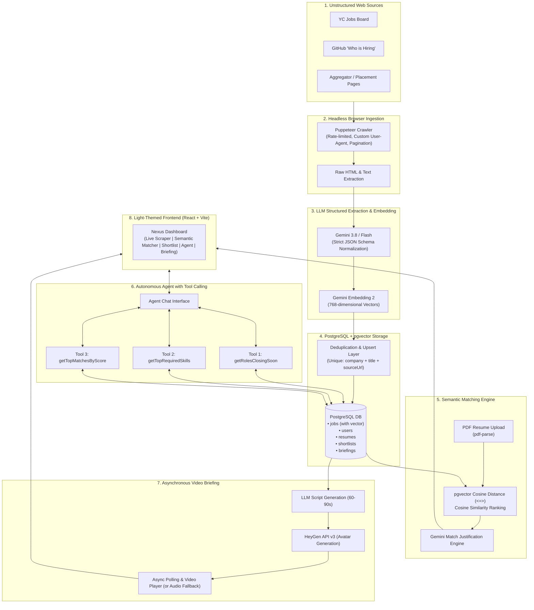

# NEXUS: Autonomous Career Intelligence Agent

> **"Scrape the messy web → structure it with an LLM → match it semantically → query it with an agent → deliver it as a generated video briefing."**

NEXUS is an end-to-end, full-stack AI career intelligence system built for the **AI and Software Guild — Software Development Recruitment 2026–27**. 

Job and internship opportunities live across messy, paginated, and unstructured web pages without clean APIs. NEXUS crawls these heterogeneous sources, extracts and validates structured job schemas via Google Gemini, indexes semantic vector embeddings with PostgreSQL & `pgvector`, matches candidates against uploaded resumes with cosine similarity and LLM justifications, offers an autonomous tool-calling chat agent, and renders weekly video briefings via HeyGen.

---
### 🚧 Unfinished & Roadmap Features
- [ ] **Automated Cron Daemon**: Background worker (e.g., node-cron or BullMQ) to re-scrape specified source URLs every 24 hours automatically.
- [ ] **Listing Change Detection**: Diffing saved listings on subsequent scrapes to flag when a job is edited or closed.
- [ ] **Live Token & Rupee Cost Dashboard**: Tracking token counts per Gemini request and computing cumulative rupee expenditures.
- [ ] **Automated Extraction Evals**: A benchmark evaluation script scoring Gemini structured extractions against a golden dataset of hand-labeled HTML pages.
- [ ] **Cloud Deployment**: Staging deployments on Railway/Render for backend and Vercel for frontend.
## 📑 Table of Contents
---

- [System Architecture](#-system-architecture)
- [Tech Stack](#-tech-stack)
- [Deduplication Strategy](#-deduplication-strategy)
- [Pipeline & Feature Breakdown](#-pipeline--feature-breakdown)
  - [1. Headless Browser Scraper](#1-headless-browser-scraper)
  - [2. LLM Structured Extraction](#2-llm-structured-extraction)
  - [3. Semantic Resume Matching (pgvector)](#3-semantic-resume-matching-pgvector)
  - [4. Autonomous Tool-Calling Agent](#4-autonomous-tool-calling-agent)
  - [5. Video Briefing Lifecycle (HeyGen)](#5-video-briefing-lifecycle-heygen)
  - [6. Multi-Tenancy & Security](#6-multi-tenancy--security)
- [Setup & Installation Guide](#-setup--installation-guide)
- [Environment Variables](#-environment-variables)
- [Database Setup & Migrations](#-database-setup--migrations)
- [Running the Project](#-running-the-project)
- [Status: What is Finished vs. Unfinished](#-status-what-is-finished-vs-unfinished)
- [Screen Recording Guide (2–4 Min Demo)](#-screen-recording-guide)

---

## 🏛 System Architecture

The following diagram illustrates the complete data flow and execution pipeline of NEXUS:

---

## 🛠 Tech Stack

| Layer | Technology | Purpose / Justification |
| :--- | :--- | :--- |
| **Frontend** | React 18, Vite, TailwindCSS, Lucide Icons | High-performance, clean, light-themed responsive SPA with instant state updates. |
| **Backend** | Node.js, Express, TypeScript | Type-safe REST API server with modular service architecture and CORS middleware. |
| **Database** | PostgreSQL + `pgvector` | Relational multi-tenant storage combined with native high-dimensional vector similarity indexing. |
| **ORM** | Prisma ORM | Schema migrations, type-safe queries, connection pooling, and raw vector operations. |
| **Scraping** | Puppeteer (Chromium Headless) | Dynamic JavaScript execution, pagination handling, and robust DOM fallback selectors. |
| **LLM & Embeddings** | Google Gemini 3.8 / Flash & `gemini-embedding-2` | Fast structured JSON schema extraction, semantic justifications, and 768-dim embeddings. |
| **PDF Extraction** | `pdf-parse`, `multer` | Native server-side parsing of uploaded resume files directly into memory buffers. |
| **Video Generation** | HeyGen API v3 | Generates AI avatar video briefings with asynchronous job polling. |

---

## 📋 Status: What is Finished

### ✅ Finished & Fully Implemented
- [x] **Headless Browser Scraper**: Puppeteer integration scraping real pages, parsing links, and collecting text.
- [x] **LLM Structured Extraction**: Strict JSON normalization with Gemini 3.8 / Flash into standard schema `{ title, company, location, remote_ok, stipend, required_skills, experience_level, deadline }`.
- [x] **Resume PDF Upload**: `pdf-parse` integration via `POST /api/resume/upload` extracting text from user-uploaded PDFs.
- [x] **pgvector Semantic Search**: Generating 768-dim embeddings via `gemini-embedding-2` and calculating cosine similarity rankings.
- [x] **LLM Justifications**: Generating contextual match explanations per listing.
- [x] **Autonomous Agent Tool Calling**: Gemini Function Calling with 3 distinct database tools (`getRolesClosingSoon`, `getTopRequiredSkills`, `getTopMatchesByScore`).
- [x] **Video Briefing Pipeline**: 60–90 second script synthesis, HeyGen API integration, async lifecycle states, and audio/script fallback.
- [x] **Multi-Tenant Authentication**: JWT authentication with password hashing and user-isolated shortlists.
- [x] **Light-Themed Frontend**: Crisp, responsive UI with real-time feedback, toasts, modals, and tabbed workflow.

---

## 👥 Authors & Acknowledgments

- **Applicant**: AI and Software Guild — Software Development Recruitment 2026–27
- **References**: Google Gemini API, PostgreSQL pgvector, HeyGen API, Puppeteer, Prisma ORM.
